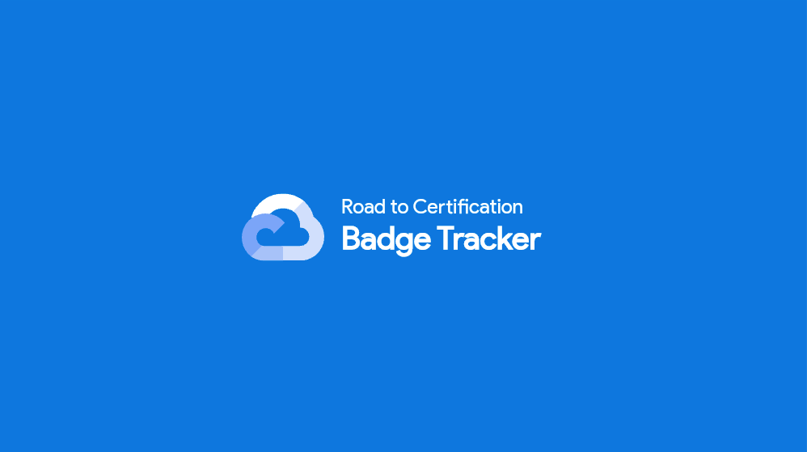
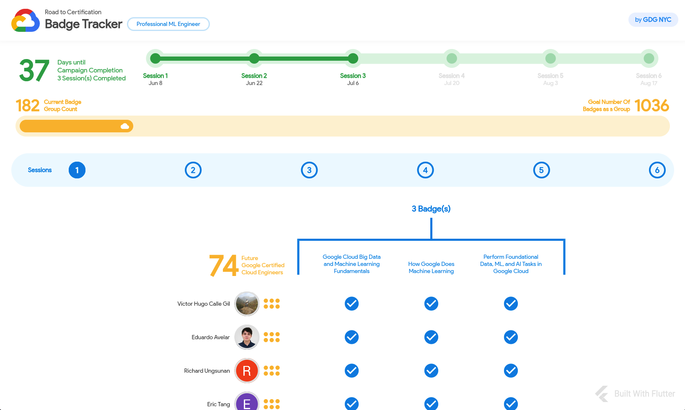

# GDG Road To Certification Campaign - Badge Tracker



- This is the "unofficial" GDG RTC campaign badge tracker.
- This web-based tracker was developed in Flutter, powered by the Google Cloud (hosted in Firebase Cloud Firestore, powered by Google Cloud Functions)
- It was originally designed for the GDG Lawrence community
- I've been making updates to it so as to make it generic enough so that any other community engaging in the RTC (Road To Certification) GDG Campaign can use it effectively.

## Features
- Track the number of sessions in the RTC campaign
- Lists the quests and badges to be accomplished for a successful completion of the campaign
- Keeps track of the top performers / members who have obtained the most badges towards a certain campaign



## Prerequisites
- You must have a Google Cloud Account with enabled billing (or a Firebase Blaze Tier account / Pay-as-you-Go) and Cloud Functions enabled 

## Getting Started

This app is developed in Flutter. You can clone this repo and made the required adjustments to make it work for your specific community.

## STEP 1: Create a Cloud Function with an HTTP Trigger
- Create a Cloud Function (2nd gen or 1st gen would do); as long as it supports HTTP triggers
- Choose a function name i.e. `badge-tracker`
- Pick a region closest to you and your rusers
- Choose `Allow unauthenticated invocations`
- Hit Next to go to the code tab
- As the runtime, use Python 3.10 or later
- In the **requirements.txt**, add the following dependencies:

```python
# requirements.txt

functions-framework==3.*
beautifulsoup4
requests

```

- In the **main.py**, add the following code, which is nothing but a simple Python script that scrapes each member's Cloud Skills Boost profile (when I get the API I'll replace this ;)).
Notice the **profile_urls** variable which currently holds the URLS to all member's public profiles. They should look like [this](https://www.cloudskillsboost.google/public_profiles/faa923f8-601f-4f68-ae20-6b6b9cf8f2dc). Encourage your members to make their profile public so the system can scrape it and access the data. Also notice the name of the method **get_badges** which is the Cloud Function's entrypoint. Make sure to add that during the Cloud Function's creation.

```python

# main.py

import functions_framework
import requests
import json
from bs4 import BeautifulSoup

# add all profile urls from all your members here
# future versions will pull this from Firestore

profile_urls = [
'https://www.cloudskillsboost.google/public_profiles/13d2fc34-8aff-44b4-adcc-77032ccf8cb2',
'https://www.cloudskillsboost.google/public_profiles/e770c4c3-5a42-495c-80cf-f9db5b4371e4',
'https://www.cloudskillsboost.google/public_profiles/1978d95d-b6af-4a61-9961-761e2f7cd45f',
'https://www.cloudskillsboost.google/public_profiles/82344445-515c-44f0-86ae-68d8d000e328',
]

@functions_framework.http
def get_badges(request):

    payload = []

    for url in profile_urls:
        response = requests.get(url)

        soup = BeautifulSoup(response.text, 'html.parser')

        badges = process_badges(soup)
        user_profile = process_user(soup, url)

        if user_profile['name'] != '':
            user_payload = {
                'badges': badges,
                'profile': user_profile
            }

            payload.append(user_payload)

    return json.dumps(payload), 200, {
        'Access-Control-Allow-Origin': '*',
        'Content-Type': 'application/json'
    }

def process_user(soup, url):
    user = {
        'name': '',
        'member_since': '',
        'avatar': '',
        'profile_link': str(url)
    }

    root_container = soup.find('main', attrs={'id': 'jump-content'})
    avatar_container = root_container.find('div', { 'class': 'text--center'})
    user['name'] = avatar_container.find('h1', { 'class': 'ql-display-small'}).text.strip()
    user['member_since'] = avatar_container.find('p', { 'class': 'ql-body-large'}).text.strip()

    try:
        avatar = avatar_container.find('ql-avatar', { 'class': 'l-mbl'})
        user['avatar'] = avatar_container.find('ql-avatar', { 'class': 'profile-avatar'})['src']
    except:
        user['avatar'] = 'https://www.gstatic.com/images/branding/product/2x/avatar_anonymous_512dp.png'

    return user

def process_badges(soup):
    profile_badges_container = soup.find('div', attrs={'class': 'profile-badges'})
    profile_badges_list = []

    try:
        profile_badges = profile_badges_container.findAll('div', { 'class': 'profile-badge'})

        for badge in profile_badges:
            badge_dic = {}
            badge_dic['badgeTitle'] = badge.find('span', { 'class': 'ql-title-medium'}).text.strip()
            badge_dic['link'] = badge.find('a', { 'class': 'badge-image'})['href']
            badge_dic['earned'] = badge.find('span', { 'class': 'ql-body-medium'}).text.strip()
            profile_badges_list.append(badge_dic)
    except:
        profile_badges_list = []

    return profile_badges_list


```

- Deploy this function and make sure you make it so it allows unauthenticated invocations (since we're making it open and public). Future implementations may require users to be authenticated.

This will output a JSON that looks like this;

```json

[
  {
    "badges": [
      {
        "badgeTitle": "Logging, Monitoring and Observability in Google Cloud",
        "link": "https://www.cloudskillsboost.google/public_profiles/13d2fc34-8aff-44b4-adcc-77032ccf8cb2/badges/2723499",
        "earned": "Earned Oct 13, 2022 EDT"
      },
      {
        "badgeTitle": "Getting Started with Google Kubernetes Engine",
        "link": "https://www.cloudskillsboost.google/public_profiles/13d2fc34-8aff-44b4-adcc-77032ccf8cb2/badges/2722095",
        "earned": "Earned Oct 13, 2022 EDT"
      },
      {
        "badgeTitle": "Elastic Google Cloud Infrastructure: Scaling and Automation",
        "link": "https://www.cloudskillsboost.google/public_profiles/13d2fc34-8aff-44b4-adcc-77032ccf8cb2/badges/2721821",
        "earned": "Earned Oct 13, 2022 EDT"
      }
    ],
    "profile": {
      "name": "Roman Jaquez",
      "member_since": "Member since 2021",
      "avatar": "https://lh3.googleusercontent.com/a-/AOh14Ghusffdg0YFZIt3cAEzViV8tIDgkkDnVcE62ylU2yE=s320-c",
      "profile_link": "https://www.cloudskillsboost.google/public_profiles/faa923f8-601f-4f68-ae20-6b6b9cf8f2dc"
    }
  },
  ...
]

```

- Grab the URL that gets generated after deploying the Cloud Function; it should look like this: **https://us-central1-YOUR_PROJECT.cloudfunctions.net/getBadges**.
- You can also use the Gist in this [link](https://gist.github.com/romanejaquez/4a5a7703681a0bbacdb842173d7498a2#file-rtc-cloudskill-badges)

## STEP 2: Configure the RTC Flutter Web App

- Clone this project to your local environment.
- In the **/assets/config/** folder, find the **badgeconfig.json** file. Change the values in this JSON as this is the configuration that feeds the app and matches your RTC campaign and powers the links and campaign name.
- Things to keep in mind:
- In the **badgeconfig.json** file, make sure that the **badgesEndpoint** property maps to your Cloud Function HTTP endpoint (as described above).
- Make sure the **sessions** array contain the dates in chronological order and index.
- Make sure each badge object inside the **badges** array contains the EXACT title as in your campaing, as we are doing a string match. Future versions will use the ID of the campaign for simplicity or just use the API.

This is a sample of the **badgeconfig.json** structure:
```json

{
    "campaign": "Associate Cloud Engineer",
    "community": "GDG Lawrence",
    "link": "https://gdg.community.dev/gdg-lawrence",
    "badgesEndpoint": "https://us-central1-YOUR-PROJECT.cloudfunctions.net/getBadges",
    "sessions": [
        {
            "index": 0,
            "isSelected": false,
            "isComplete": false,
            "date": "2023-06-08T00:00:00Z",
            "badges": [
                {
                    "badgeTitle": "Google Cloud Big Data and Machine Learning Fundamentals",
                    "link": "https://www.cloudskillsboost.google/course_templates/3",
                    "isComplete": false
                },
                ...
            ]
        },
        ...
    ]
}
```


## STEP 3: Build the Flutter Web App

- After making the required changes, build the Flutter Web app by running ```flutter build web```.
- A web app package gets generated in the ```/build/web``` folder, which you can use then to deploy to any web server of your choice. I like using **Firebase Hosting** as it provides a custom domain, SSL by default and works well with Flutter. But you can even host it on Github Pages or anywhere else.

## STEP 4: Enjoy tracking the badges earned with your community!

### Please submit any feedbacks / bugs by submitting an issue to this repo and I'll get to it as fast as humanly possible.

Thank you for your support!

### Don't forget to follow me on social media:

- On Twitter ([@drcoderz](https://www.twitter.com/drcoderz))
- On YouTube ([Roman Just Codes](https://www.youtube.com/channel/UCKsp3r1ERjCpKJtD2n5WtPg))
- On my [Personal Portfolio](https://romanjustcodes.web.app/)
- On [Medium](https://medium.com/@romanejaquez)
- On [LinkedIn](https://www.linkedin.com/in/roman-jaquez-8941a424/)
